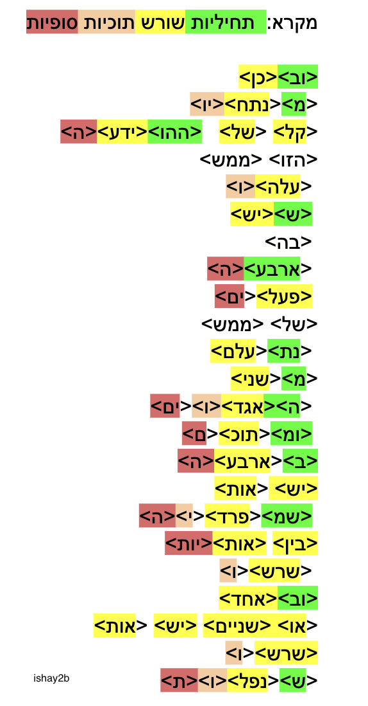

#טוקנייזר עיברי שמחלץ את השורש של כל מילה ומפרק ל 4 חלקים:
##תחיליות
##שורש
##אמצעיות
##סופיות

לדוגמא:
יתכנסו
<ית><כנס<ו>
הודעה:
<הו><ידע><ה>

המוטיבציה היא שימוש במבנה היחודי של עיברית כך שזיהוי השורש מאפשר להציב את כל שאר האותיות כ״תחיליות״, ״אמצעיות״ ו״סופיות״

פירוק כזה מאפשר שימור מלא של כל ההקשרים הסמנטיים בייצוג מימדים נמוך. מימדים קטנים מאפשרים אימון מנוע שפה עיברי בשימוש מעט דאטה יחסית לאלטרנטיבות. האלטרנטיבה הראשונה היא כמובן יצוג כל אות עי טוקן משלה שזה יצוג ממימד גבוה שמאבד הקשרים סמנטים ודורש הרבה דאטה לצרכי אימון.

#רישיון שימוש: כל קוד או מידע שיוצג באתר נתון לשימוש חופשי מלא כולל שינוי ושימוש מסחרי בשביל לאפשר לקהילה לייצר טוקנייזר עיברי יעיל עבור מנועי השפה שירוצו על הניידים.

